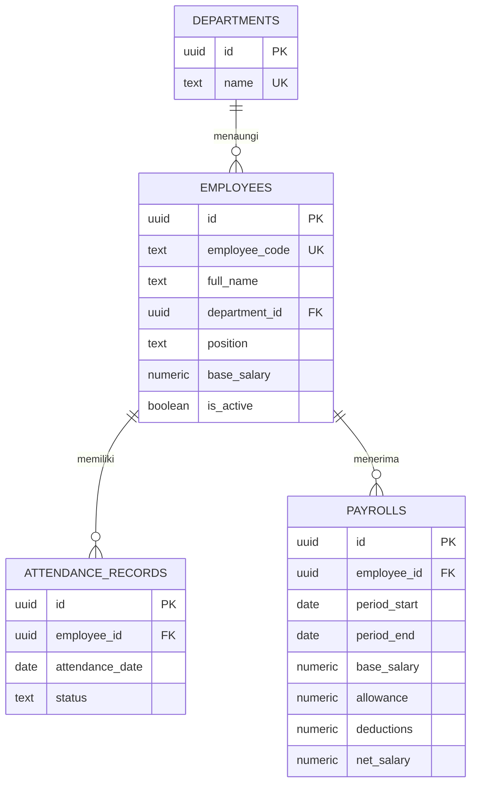

# Ruang Gaji

Aplikasi web penggajian rumah sakit sederhana. Frontend HTML, CSS, dan JavaScript; backend Node.js bawaan; basis data Supabase (PostgreSQL).

## Struktur

```text
frontend/
  index.html
  styles.css
  app.js
backend/
  app.js
  schema.sql
.github/workflows/
  deploy-pages.yml
```

## ERD



`net_salary` dihitung otomatis oleh PostgreSQL: gaji pokok + tunjangan - potongan. Setiap pegawai hanya memiliki satu catatan kehadiran per tanggal dan satu penggajian untuk periode yang sama.

## Setup Supabase

Jalankan `backend/schema.sql` di Supabase **SQL Editor**. Jika skema lama sudah pernah dijalankan, jalankan file terbaru ini lagi agar kebijakan akses demo ikut diterapkan.

Frontend memakai URL proyek dan publishable key di `frontend/app.js`. Publishable key memang dapat dilihat publik; jangan pernah menggantinya dengan `service_role` atau secret key.

## Deploy ke GitHub Pages

GitHub Pages menerbitkan isi `frontend/` sebagai situs statis. `backend/app.js` tetap ada di folder backend, tetapi GitHub Pages tidak menjalankannya; frontend terbitan mengakses Supabase secara langsung. Push perubahan ke branch `main` untuk menjalankan workflow GitHub Actions.

Aktifkan GitHub Pages satu kali di repository: **Settings > Pages > Build and deployment > Source > GitHub Actions**. Setelah workflow selesai, URL Pages akan tercantum di tab **Actions** atau **Settings > Pages**.

> **Penting untuk demo saja:** kebijakan Supabase dalam schema ini mengizinkan siapa pun membaca dan menambahkan data. Jangan masukkan data pegawai sungguhan. Jangan deploy versi ini untuk produksi tanpa autentikasi dan kebijakan akses per pengguna.