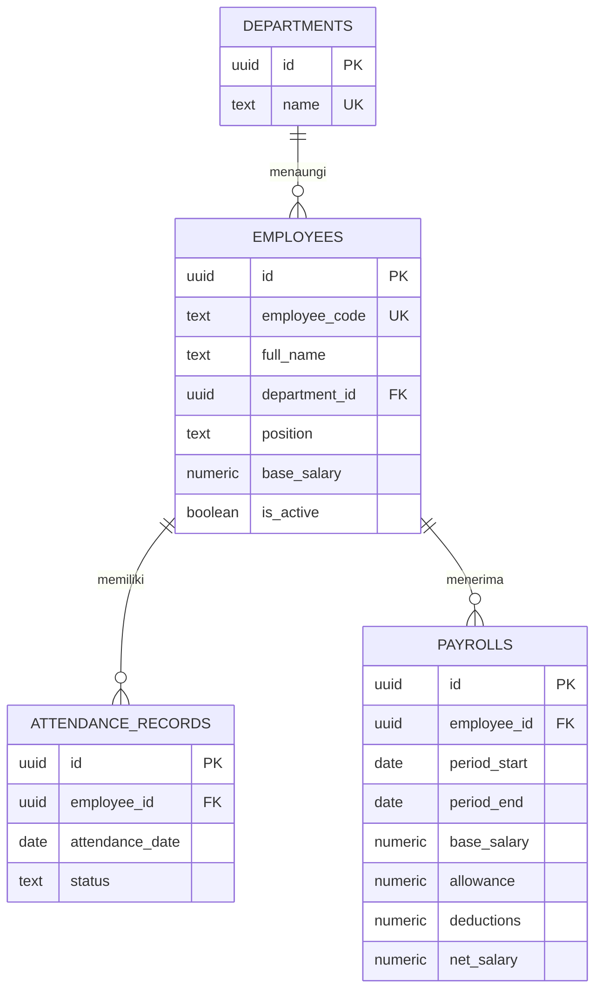

# Ruang Gaji

Aplikasi web penggajian rumah sakit sederhana. Frontend HTML, CSS, dan JavaScript; backend Node.js bawaan; basis data Supabase (PostgreSQL).

## Struktur

```text
public/
  index.html
  styles.css
  app.js
backend/
  app.js
  schema.sql
server.js
```

## ERD



`net_salary` dihitung otomatis oleh PostgreSQL: gaji pokok + tunjangan - potongan. Setiap pegawai hanya memiliki satu catatan kehadiran per tanggal dan satu penggajian untuk periode yang sama.

## Menjalankan

1. Di Supabase **SQL Editor**, jalankan isi `backend/schema.sql`.
2. Siapkan Node.js 18 atau lebih baru. Ambil **Project URL** dan **service_role key** dari pengaturan API Supabase. Jangan menaruh service role key di frontend atau membagikannya ke publik.
3. Buka PowerShell dari folder proyek, lalu set konfigurasi untuk sesi terminal saat ini:

   ```powershell
   $env:SUPABASE_URL = "https://PROJECT_REF.supabase.co"
   $env:SUPABASE_SERVICE_ROLE_KEY = "SERVICE_ROLE_KEY"
   node backend/app.js
   ```

4. Buka `http://localhost:3000`.

Server menyajikan frontend dan API pada origin yang sama. Jika koneksi belum tersedia, pastikan SQL sudah dijalankan dan variabel Supabase terisi. API menyediakan daftar/tambah pegawai, catatan kehadiran, serta pembuatan dan daftar penggajian.

> Ini fondasi tugas/demo, bukan sistem payroll produksi. Sebelum dipakai dengan data pegawai sungguhan, tambahkan autentikasi, otorisasi per peran, audit log, dan tinjauan aturan payroll yang berlaku.

## Deploy ke Vercel

Hubungkan repository GitHub ke Vercel dan pastikan **Root Directory** menunjuk ke folder proyek ini (kosongkan jika repository langsung berisi `server.js`). Vercel mengenali `server.js` sebagai server Node; aset frontend berada di `public/` dan API tetap dilayani oleh backend.

Di pengaturan proyek Vercel, gunakan **Other** sebagai Framework Preset dan tambahkan `SUPABASE_URL` serta `SUPABASE_SERVICE_ROLE_KEY` pada Environment Variables. Jangan menambahkan secret ke file proyek. Deploy ulang setelah menyimpan variabel.

> **Keamanan:** aplikasi saat ini belum memiliki login atau otorisasi. Gunakan hanya data dummy sampai akses API dilindungi.